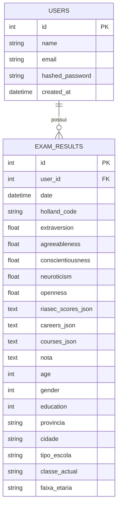

# Guia de Documentação UML — Sistema RIASEC/Holland

Este guia dá-te tudo o que precisas para desenhar os diagramas no **Astah**:
actores, casos de uso, fluxos de actividade, mensagens de sequência,
componentes e o modelo de dados (MER). Os nomes usados correspondem ao código
real do projecto (`src/api/`, `mobile/src/`), para que os diagramas fiquem
fiéis ao sistema.

---

## 1. Diagrama de Casos de Uso

### 1.1. Actores

| Actor | Descrição |
|---|---|
| **Utilizador** | Estudante que usa a app mobile ou o cliente web para fazer o teste vocacional. |
| **Sistema de Previsão (ML)** | Actor secundário/não-humano — o modelo treinado (`riasec_tipi_et_tuned.pkl`) que a API invoca. Representa-se como actor quando queres mostrar que o caso de uso "Prever Perfil Vocacional" depende de um serviço externo ao fluxo do utilizador. |

> Não há actor "Administrador" — o sistema actual não tem painel de gestão.

### 1.2. Casos de uso e relações

Casos de uso principais (agrupa-os num pacote "RIASEC App" no Astah):

1. **Registar Conta** (`POST /auth/register`)
2. **Autenticar-se** (`POST /auth/login`)
3. **Responder Questionário RIASEC** (48 perguntas, 8 por dimensão)
4. **Preencher Dados Demográficos** (idade, género, província, escola, etc. — opcional)
5. **Prever Perfil Vocacional** — inclui (`<<include>>`) os casos 3 e 4
6. **Consultar Resultados** (código Holland, Big Five, carreiras, cursos)
7. **Guardar Avaliação no Histórico** (`POST /exams`) — estende (`<<extend>>`) o caso 6, só ocorre se o utilizador estiver autenticado
8. **Consultar Histórico de Avaliações** (`GET /exams`)
9. **Comparar Duas Avaliações** (tela `CompareScreen`)
10. **Consultar Detalhes de Universidade** (`GET /universities/{codigo}/{area}`)
11. **Consultar Sobre a App** (tela `AboutScreen`)

Relações a desenhar:

- `Prever Perfil Vocacional` **include** `Responder Questionário RIASEC`
- `Prever Perfil Vocacional` **include** `Preencher Dados Demográficos`
- `Guardar Avaliação no Histórico` **extend** `Consultar Resultados` (condição: utilizador autenticado)
- `Consultar Histórico` **include** `Comparar Duas Avaliações` (opcional, podes pôr como extend também)
- `Autenticar-se` e `Registar Conta` não exigem login (pré-condição zero)
- Todos os outros casos de uso (3–10) têm como pré-condição "Utilizador autenticado", excepto se decidires permitir teste anónimo no cliente web (`src/web/`) — nesse caso, separa um actor **Visitante** para o caso 5/6 sem histórico.

**No Astah:** cria o actor `Utilizador`, liga-o por associação simples a 1, 2, 3/4/5/6, 8, 9, 10, 11. Usa setas pontilhadas com `<<include>>` (de "Prever Perfil Vocacional" para os dois casos incluídos) e `<<extend>>` (de "Guardar Avaliação" para "Consultar Resultados").

---

## 2. Diagramas de Actividade

### 2.1. Actividade 1 — Fluxo completo da Avaliação Vocacional

Representa o percurso do utilizador desde que inicia o teste até ver o resultado. Nós a incluir:

```
(start)
  → Ecrã "AssessmentIntro" (explicação do teste)
  → [loop] Responder pergunta (QuestionScreen) — repete para as 48 perguntas
       → decisão: "Última pergunta?" → não → próxima pergunta
                                      → sim → continua
  → Ecrã "Demographics" (preencher idade/género/província/escola — opcional)
  → decisão: "Preencheu demografia?" → sim/não (ambos seguem, campos ficam null)
  → Ecrã "Loading" → chamada POST /predict (fork para a actividade 2)
  → decisão: "Resposta da API OK?"
       → não → mostrar erro / permitir retry
       → sim → Ecrã "Results" (mostrar holland_code, riasec_scores, big5, careers, courses)
  → decisão: "Utilizador autenticado?"
       → sim → acção "Guardar Avaliação" (POST /exams) → fim
       → não → fim (resultado não persiste)
(end)
```

Usa uma **swimlane** por participante: `Utilizador`, `App Mobile`, `API`. As acções de chamada de rede (`POST /predict`, `POST /exams`) ficam na lane da API.

### 2.2. Actividade 2 — Pipeline de Inferência (`predict()` em `src/api/predict.py`)

Esta é a actividade interna que acontece dentro da API quando recebe `POST /predict`. Boa para mostrar a lógica de negócio do modelo, não apenas a navegação de telas.

```
(start)
  → Receber RiasecInput (48 itens + demografia opcional)
  → Calcular score_R..score_C (média dos 8 itens de cada dimensão)
  → decisão: "Campos demográficos fornecidos?"
       → não → aplicar valores padrão (_DEMO_DEFAULTS)
       → sim → usar valores recebidos (idade, género, educação)
  → Montar vector de features na ordem de _FEATURE_ORDER
  → Acção: model.predict(X) → obter Big Five (extraversion...openness)
  → Acção: ordenar as 6 dimensões por score decrescente → construir holland_code (top 3 letras)
  → Acção paralela (fork):
       ramo A → lookup_careers(holland_code) [fallback 3→2→1 letras]
       ramo B → lookup_courses(holland_code) + get_employability(area, provincia)
  → (join)
  → Construir PredictionResponse
  → Retornar 200 OK
(end)
```

Esta actividade é só uma swimlane (API), mas podes separar em duas — "Camada HTTP" (`main.py`) e "Camada de Domínio" (`predict.py`/`career_map.py`/`course_map.py`) — se quiseres mostrar a separação de responsabilidades.

---

## 3. Diagramas de Sequência

### 3.1. Sequência 1 — Login

Lifelines: `:Utilizador` → `:LoginScreen` (mobile) → `:AuthRouter` (`/auth/login`) → `:User` (modelo SQLAlchemy) → `:DB`

```
Utilizador          -> LoginScreen     : preenche email/senha, toca "Entrar"
LoginScreen         -> AuthRouter      : POST /auth/login {email, password}
AuthRouter          -> DB              : SELECT * FROM users WHERE email = ?
DB                  --> AuthRouter     : User | null
AuthRouter          -> AuthRouter      : _pwd.verify(password, hashed_password)
alt credenciais inválidas
  AuthRouter        --> LoginScreen    : 401 Credenciais inválidas
  LoginScreen        -> Utilizador     : mostra erro
else credenciais válidas
  AuthRouter         -> AuthRouter     : create_access_token(user.id)
  AuthRouter        --> LoginScreen    : 200 {token, user}
  LoginScreen        -> useAuthStore   : guarda token (persistência local)
  LoginScreen        -> Utilizador     : navega para MainTabs
end
```

No Astah: usa um `alt` (combined fragment) para os dois ramos de credenciais. A "Camada DB" pode ser representada como uma lifeline `:exam_results` ou simplesmente `:Base de Dados (SQLite)`.

### 3.2. Sequência 2 — Responder questionário e gerar previsão (com gravação no histórico)

Lifelines: `:Utilizador` → `:QuestionScreen` → `:DemographicsScreen` → `:LoadingScreen` → `:PredictAPI` (`main.py` + `predict.py`) → `:ModeloML` (`riasec_tipi_et_tuned.pkl`) → `:ExamsRouter` (`/exams`) → `:DB`

```
Utilizador        -> QuestionScreen   : responde às 48 perguntas (loop)
QuestionScreen     -> DemographicsScreen : navega ao terminar perguntas
Utilizador         -> DemographicsScreen : preenche dados (opcional) / salta
DemographicsScreen -> LoadingScreen    : navega com respostas acumuladas
LoadingScreen      -> PredictAPI       : POST /predict {48 itens, demografia}
PredictAPI         -> ModeloML         : model.predict(X)
ModeloML          --> PredictAPI       : vector Big Five
PredictAPI         -> PredictAPI       : lookup_careers(holland_code)
PredictAPI         -> PredictAPI       : lookup_courses(holland_code)
PredictAPI        --> LoadingScreen    : 200 PredictionResponse
LoadingScreen      -> Utilizador       : navega para ResultsScreen (mostra resultado)
opt utilizador autenticado
  Utilizador        -> ResultsScreen   : confirma "Guardar no histórico"
  ResultsScreen      -> ExamsRouter    : POST /exams {holland_code, big5, scores, careers, courses}
  ExamsRouter        -> DB             : INSERT INTO exam_results (...)
  DB                --> ExamsRouter    : exam criado
  ExamsRouter       --> ResultsScreen  : 201 ExamOut
end
```

Usa um `opt` (fragmento opcional) para o bloco de gravação — só ocorre se houver token JWT válido.

---

## 4. Diagrama de Componentes

Componentes de alto nível e as suas dependências (setas de seta tracejada = "depends on" / interface usada):

```
┌─────────────────────┐        ┌─────────────────────┐
│   App Mobile         │        │   Cliente Web         │
│  (React Native/Expo)  │        │  (src/web/*.html,js)   │
└──────────┬───────────┘        └──────────┬───────────┘
           │ HTTP/JSON (REST)               │ HTTP/JSON (REST)
           ▼                                ▼
┌──────────────────────────────────────────────────────┐
│                    API FastAPI (src/api)              │
│  ┌───────────────┐  ┌───────────────┐  ┌────────────┐ │
│  │ auth.router    │  │ exams.router   │  │ main (root,│ │
│  │ (/auth/*)       │  │ (/exams/*)      │  │ /predict,  │ │
│  │                │  │                │  │ /questions)│ │
│  └──────┬────────┘  └──────┬────────┘  └─────┬──────┘ │
│         │                  │                  │        │
│  ┌──────▼──────────────────▼──────┐   ┌───────▼──────┐ │
│  │   db.database / db.models       │   │  predict.py   │ │
│  │   (SQLAlchemy ORM)               │   │  (inferência) │ │
│  └──────────────┬──────────────────┘   └───────┬──────┘ │
│                 │                                │       │
│                 │                       ┌────────▼─────┐ │
│                 │                       │ career_map.py │ │
│                 │                       │ course_map.py │ │
│                 │                       └──────────────┘ │
└─────────────────┼──────────────────────────────┬────────┘
                   ▼                              ▼
        ┌──────────────────┐          ┌────────────────────────┐
        │  Base de Dados     │          │  Artefacto do Modelo     │
        │  (SQLite/Postgres) │          │  riasec_tipi_et_tuned.pkl │
        │  users, exam_results│         │  (treinado offline)      │
        └──────────────────┘          └────────────────────────┘
```

Componentes a desenhar no Astah (caixas UML2 com ícone de componente, não só rectângulos):

- `App Mobile` — fornece nada, **requer** interface `REST API`
- `Cliente Web` — **requer** interface `REST API`
- `API FastAPI` — **fornece** interface `REST API`; internamente composto por sub-componentes `auth.router`, `exams.router`, `main`, `predict`, `career_map`, `course_map`, `db`
- `Base de Dados` — **fornece** interface `SQL`, usada por `db.database`
- `Artefacto do Modelo (.pkl)` — **fornece** interface `joblib.load`, usada por `predict.py`

Se o Astah pedir "provided/required interfaces" como pequenos círculos/semicírculos (notação lollipop), usa:
- `REST API` como lollipop fornecido pela API e requerido pelos dois clientes
- `Persistência` como lollipop entre `db.models` e a Base de Dados

---

## 5. MER — Modelo Entidade-Relacionamento

### 5.1. Entidades e atributos (baseado em `src/api/db/models.py`)

**User**
| Atributo | Tipo | Notas |
|---|---|---|
| id (PK) | INTEGER | auto increment |
| name | VARCHAR(120) | NOT NULL |
| email | VARCHAR(255) | UNIQUE, NOT NULL |
| hashed_password | VARCHAR(255) | NOT NULL |
| created_at | DATETIME | default = agora (UTC) |

**ExamResult**
| Atributo | Tipo | Notas |
|---|---|---|
| id (PK) | INTEGER | auto increment |
| user_id (FK → User.id) | INTEGER | NOT NULL |
| date | DATETIME | default = agora (UTC) |
| holland_code | VARCHAR(3) | NOT NULL |
| extraversion | FLOAT | |
| agreeableness | FLOAT | |
| conscientiousness | FLOAT | |
| neuroticism | FLOAT | |
| openness | FLOAT | |
| riasec_scores_json | TEXT | JSON serializado (lista de 6 scores) |
| careers_json | TEXT | JSON serializado |
| courses_json | TEXT | JSON serializado |
| nota | TEXT | |
| age | INTEGER | nullable |
| gender | INTEGER | nullable |
| education | INTEGER | nullable |
| provincia | VARCHAR(50) | nullable |
| cidade | VARCHAR(80) | nullable |
| tipo_escola | VARCHAR(20) | nullable |
| classe_actual | VARCHAR(40) | nullable |
| faixa_etaria | VARCHAR(10) | nullable |

### 5.2. Relacionamento

- **User (1) — (0..N) ExamResult**: um utilizador pode ter zero ou várias avaliações guardadas; cada avaliação pertence a exactamente um utilizador.
  Cardinalidade no Astah: `User "1" —— "0..*" ExamResult`.
  `ON DELETE CASCADE` (ver `cascade="all, delete-orphan"` no código) — ao apagar o utilizador, apagam-se as suas avaliações.

> Nota: `riasec_scores_json`, `careers_json` e `courses_json` guardam estruturas JSON (listas de objectos) em texto, em vez de tabelas normalizadas separadas. Se quiseres um MER "mais normalizado" (3FN) para fins académicos, podes propor entidades adicionais — `DimensionScore(exam_id, letter, score)`, `CareerSuggestion(exam_id, title, ...)`, `CourseRecommendation(exam_id, name, area, ...)` — todas em relação 1:N com `ExamResult`. Isto não existe assim no código actual; é uma normalização teórica que vale a pena mencionar no relatório como "modelo alvo" vs. "modelo implementado".

### 5.3. Schema DBML — para gerar o ER online (dbdiagram.io)

Cola isto em **https://dbdiagram.io** (ou qualquer ferramenta que aceite DBML) para gerar o diagrama automaticamente:

```dbml
Table users {
  id int [pk, increment]
  name varchar(120) [not null]
  email varchar(255) [not null, unique]
  hashed_password varchar(255) [not null]
  created_at datetime [default: `now()`]
}

Table exam_results {
  id int [pk, increment]
  user_id int [not null, ref: > users.id]
  date datetime [default: `now()`]
  holland_code varchar(3) [not null]

  extraversion float
  agreeableness float
  conscientiousness float
  neuroticism float
  openness float

  riasec_scores_json text
  careers_json text
  courses_json text
  nota text

  age int
  gender int
  education int

  provincia varchar(50)
  cidade varchar(80)
  tipo_escola varchar(20)
  classe_actual varchar(40)
  faixa_etaria varchar(10)
}

Ref: exam_results.user_id > users.id [delete: cascade]
```

Alternativa Mermaid (se preferires colar num renderer Mermaid, ex. mermaid.live):



---

## 6. Checklist para o Astah

- [ ] Diagrama de Casos de Uso — 1 actor humano (`Utilizador`), 11 casos de uso, relações `include`/`extend` da secção 1.2
- [ ] Actividade 1 — fluxo de avaliação (3 swimlanes: Utilizador, App, API)
- [ ] Actividade 2 — pipeline de inferência dentro de `predict.py`
- [ ] Sequência 1 — Login (com fragmento `alt`)
- [ ] Sequência 2 — Questionário → Previsão → Gravação (com fragmento `opt`)
- [ ] Componentes — App Mobile, Cliente Web, API (com sub-componentes), DB, Artefacto `.pkl`
- [ ] MER — `users` 1—N `exam_results`, com FK e cascade
